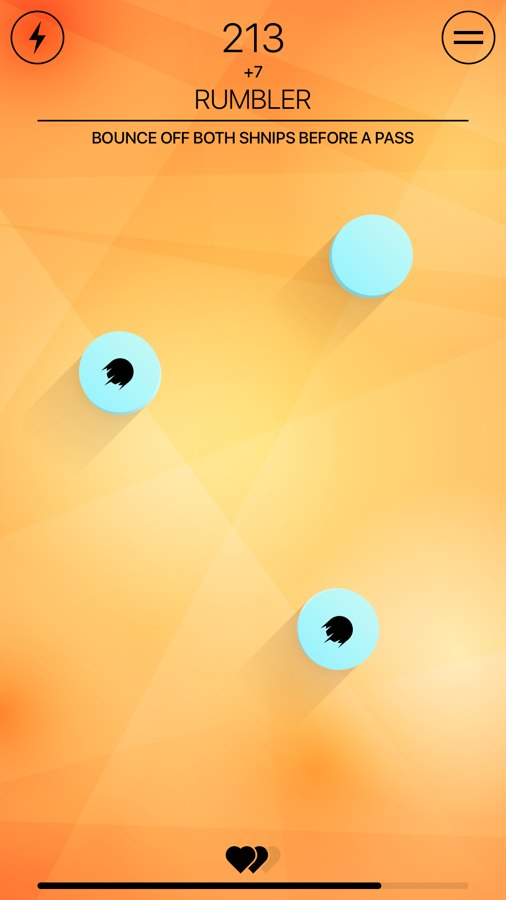
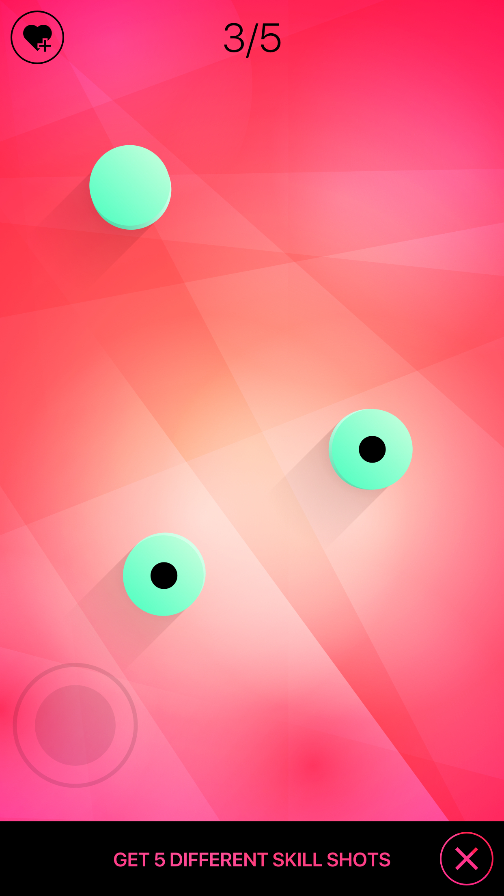
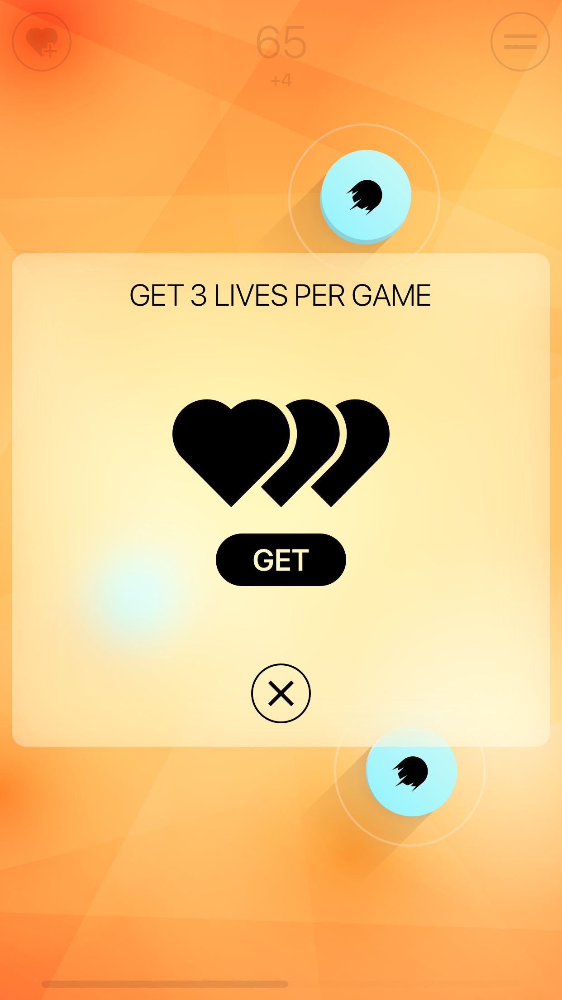
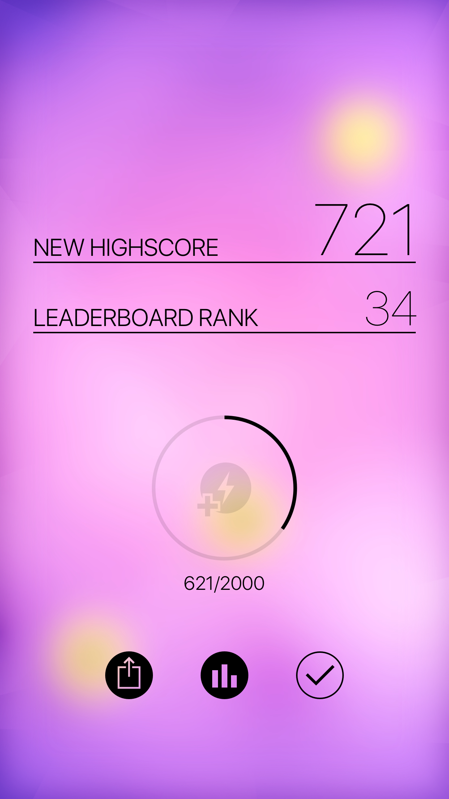
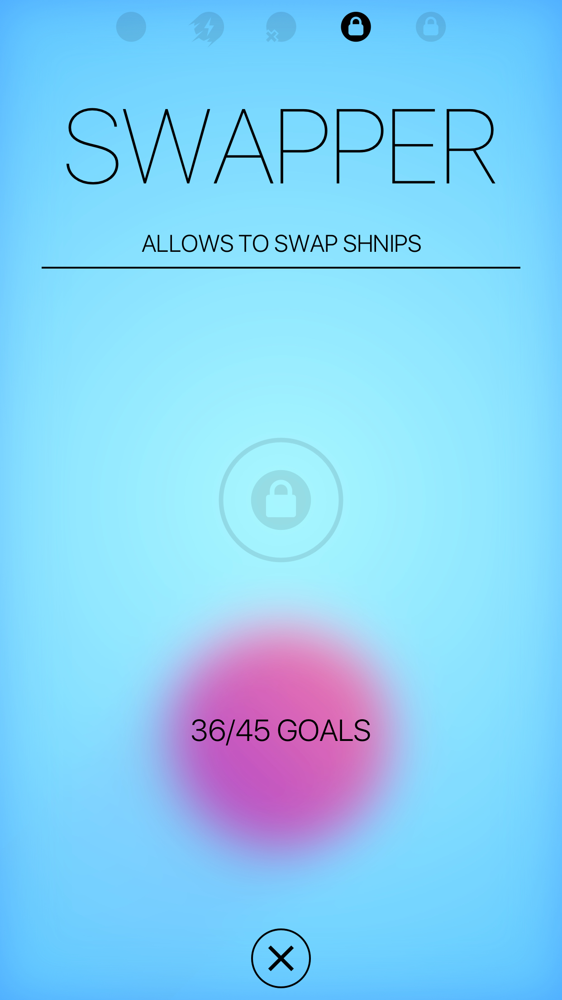

# Shnips

A Simply Beautiful, Incredibly Addictive Game for iOS & Android

  

    
    
  

 

  
  
  
  
  

## Usage
Shnips is no longer available on the App Store and Google Play. However, you can build it yourself using [Xcode](https://apps.apple.com/us/app/xcode/id497799835) or [Android Studio](https://developer.android.com/studio). In order to build the source code and deploy it to your mobile phone you'll have to create a developer account and the required signing certificates. Advanced features such as in-app purchases and achievements require a more sophisticated setup.
